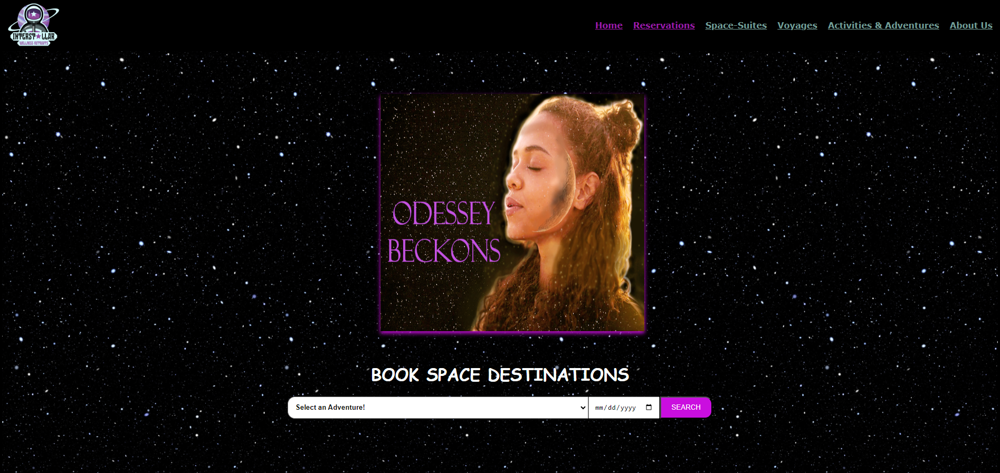

# Caty's Web Development Portfolio

## Introduction

Welcome to my web development portfolio! Hi, I'm Caty, a web developer specializing in e-commerce and custom web solutions. This portfolio showcases some of my recent projects, highlighting my skills and expertise in coding, web development, and creating user-friendly, interactive websites.

## Projects

### StayConnect


**Description**: StayConnect is a website designed to empower and educate our aging population to confidently navigate and embrace modern technology.

- **Technologies Used**: [List the main technologies and tools used, e.g., React, CSS, etc.]
- **Features**:
  - User-friendly interface
  - Educational resources
  - Tech support guides
- **GitHub Repository**: [StayConnect GitHub Repo](https://github.com/username/stayconnect)

### Interstellar Wellness Retreats



**Description**: Interstellar Wellness Retreats is a luxury, wellness-based Destination Management Company (DMC) based in outer space.

- **Technologies Used**: [List the main technologies and tools used, e.g., HTML, CSS, JavaScript, etc.]
- **Features**:
  - Interactive booking system
  - Detailed retreat descriptions
  - Wellness tips and articles
- **GitHub Repository**: [Interstellar Wellness Retreats GitHub Repo](https://github.com/Caty1121/my-portfolio.git)

### ActivityNest

 (Update with the correct image once available)

**Description**: ActivityNest is a subscription-based service aimed at getting families together and outdoors through curated activities and resources.

- **Technologies Used**: [List the main technologies and tools used, e.g., React, Node.js, etc.]
- **Features**:
  - Monthly subscription plans
  - Outdoor activity suggestions
  - Family bonding tips
- **GitHub Repository**: [ActivityNest GitHub Repo](https://github.com/Caty1121/my-portfolio.git)

## Getting Started

To run this project locally, follow these steps:

1. **Clone the repository**:
   ```bash
   git clone https://github.com/Caty1121/my-portfolio.git
